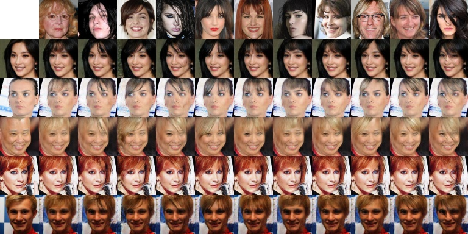
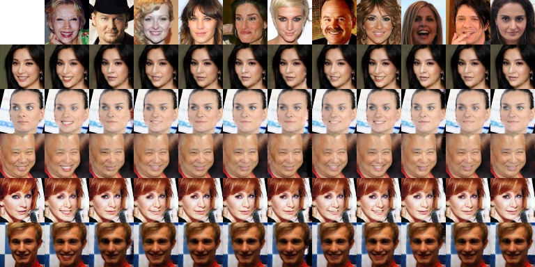
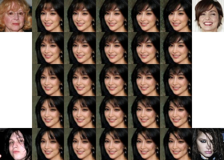

# GeneGAN: Learning Object Transfiguration and Attribute Subspace from Unpaired Data

By Shuchang Zhou, Taihong Xiao, Yi Yang, Dieqiao Feng, Qinyao He, Weiran He

### Introduction

This is the official source code for the paper GeneGAN: Learning Object Transfiguration 
and Attribute Subspace from Unpaired Data. All the experiments are initially done in 
our private deep learning framework. For convenience, we reproduce the results using TensorFlow.


<div style="text-align: center">

</div>   
<br/>

GeneGAN is a deterministic conditional generative model that can learn to disentangle the object
features from other factors in feature space from weak supervised 0/1 labeling of training data.
It allows fine-grained control of generated images on a certain attribute in a continous way.

### Training GeneGAN on celebA dataset

1.  Download [celebA](http://mmlab.ie.cuhk.edu.hk/projects/CelebA.html) dataset and unzip it into 
`dataset` directory. Please ensure that you have the following directory tree structure, and the 
resolution of all images is 418x594.
```
├── datasets
│   └── celebA
│       ├── data
│       ├── list_attr_celeba.txt
│       └── list_landmarks_celeba.txt
```

1.  Run `preprocess.py`. It will take several miniutes to preprocess all face images. 

1.  Run `python train.py -a Smiling -g 0` to train a GeneGAN. You can find all available 
attribute names in the `list_attr_celeba.txt` file. 

1.  Run `tensorboard --logdir='./' --port 6006` to examine the training process.

### Results


##### 1. Swapping of Attributes 

You can easily replace the object for images in each row with those of the column heads. 

<div style="text-align: center">

<center>Bangs</center>
</div>   
<br/>

<div style="text-align: center">

<center>Smiling</center>
</div>
<br/>

<div style="text-align: center">

<center>Eyeglasses</center>
</div>
<br/>


##### 2. Generalization to Unseen Images 

We can use GeneGAN trained on celebA dataset to swap attributes of images in the Wider Face dataset.

<div style="text-align: center">

<center>Bangs</center>
</div>
<br/>

##### 3. Interpolation in Attribute Subspace

GeneGAN can disentangle certain attribute from a large image space. The attributes subspace is almost linear 
so that we can do interpolation in this subspace.

<div style="text-align: center">

<center>Bangs</center>
</div>
<br/>

