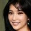
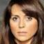

# GeneGAN: Learning Object Transfiguration and Attribute Subspace from Unpaired Data

By Shuchang Zhou, Taihong Xiao, Yi Yang, Dieqiao Feng, Qinyao He, Weiran He

### Introduction

This is the official source code for the paper GeneGAN: Learning Object Transfiguration 
and Attribute Subspace from Unpaired Data. All the experiments are initially done in 
our private deep learning framework. For convenience, we reproduce the results using TensorFlow.

<div align="center">

</div> 
<br/>

GeneGAN is a deterministic conditional generative model that can learn to disentangle the object
features from other factors in feature space from weak supervised 0/1 labeling of training data.
It allows fine-grained control of generated images on a certain attribute in a continous way.

### Training GeneGAN on celebA dataset

0. Download [celebA](http://mmlab.ie.cuhk.edu.hk/projects/CelebA.html) dataset and unzip it into 
`datasets` directory. Please ensure that you have the following directory tree structure, and the 
resolution of all images is 418x594.

```
├── datasets
│   └── celebA
│       ├── data
│       ├── list_attr_celeba.txt
│       └── list_landmarks_celeba.txt
```

1. Run `preprocess.py`. It will take several miniutes to preprocess all face images.

2. Run `python train.py -a Smiling -g 0` to train a GeneGAN. You can find all available 
attribute names in the `list_attr_celeba.txt` file. 

3. Run `tensorboard --logdir='./' --port 6006` to examine the training process.

4. We provide three kinds of mode for test. Have fun!

	* Swap two images attributes. 

		`python test.py -m swap -i input_image_name -t target_image_name --model_dir train_log/model/ -g 0` 

	* Linear interpolation between input image and target image. 

		`python test.py -m interpolation -i input_image_name -t target_image_name -n 5 --model_dir train_log/model/ -g 0` 

	* Matrix interpolation between input image and four target images.

		`python test.py -m matrix -i input_image_name --targets target1 target2 target3 target4 -s 5 5 --model_dir train_log/model/ -g 0` 


### Results


#### 1. Swapping of Attributes 

You can easily replace the Bangs of one person by running 

    python test.py -m swap -i datasets/celebA/align_5p/182929.jpg -t datasets/celebA/align_5p/035460.jpg

<div align="center">




</div>
<div align="center">
Swap Attributes
</div>
<br/>


#### 2. Linear Interpolation of Image Attributes

We can control how much the target attribute is interpolated on the source images
by linear interpolation. Run

    python test.py -m interpolation -i datasets/celebA/align_5p/182929.jpg -t datasets/celebA/align_5p/035460.jpg -n 5

<div align="center">

</div>
<div align="center">
Linear Interpolation
</div>
<br/>

#### 3. Matrix Interpolation in Attribute Subspace

We can do something cooler. Given four images with Bangs attributes at hand,
we can observe the gradual change process of our input images with a mixing of
difference bangs style.

    python test.py -m matrix -i datasets/celebA/align_5p/182929.jpg -targets datasets/celebA/align_5p/035460.jpg datasets/celebA/align_5p/035451.jpg datasets/celebA/align_5p/035463.jpg datasets/celebA/align_5p/035474.jpg -s 5 5

will gives the matrix interpolation results in attribute subspace.

<div align="center">

</div>
<div align="center">
Matrix Interpolation
</div>
<br/>

